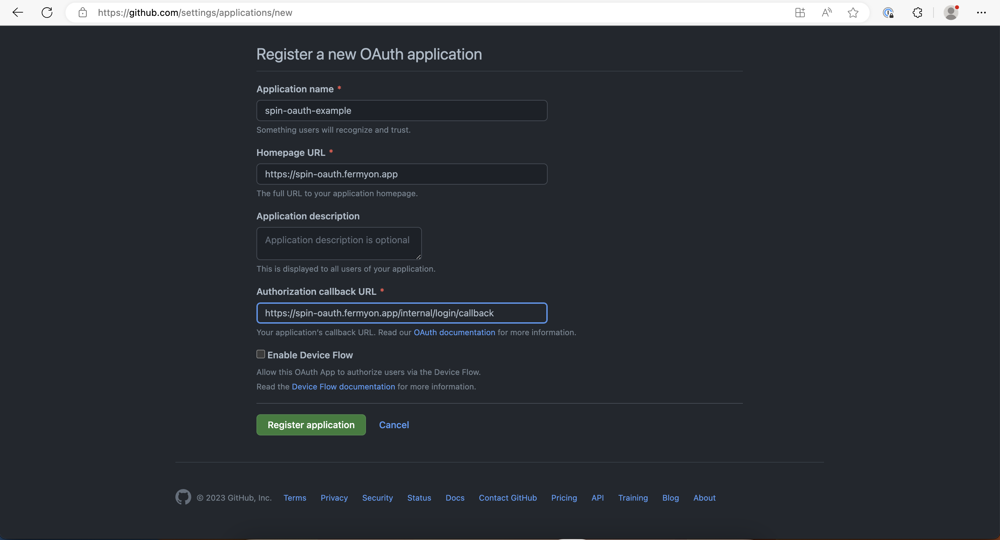
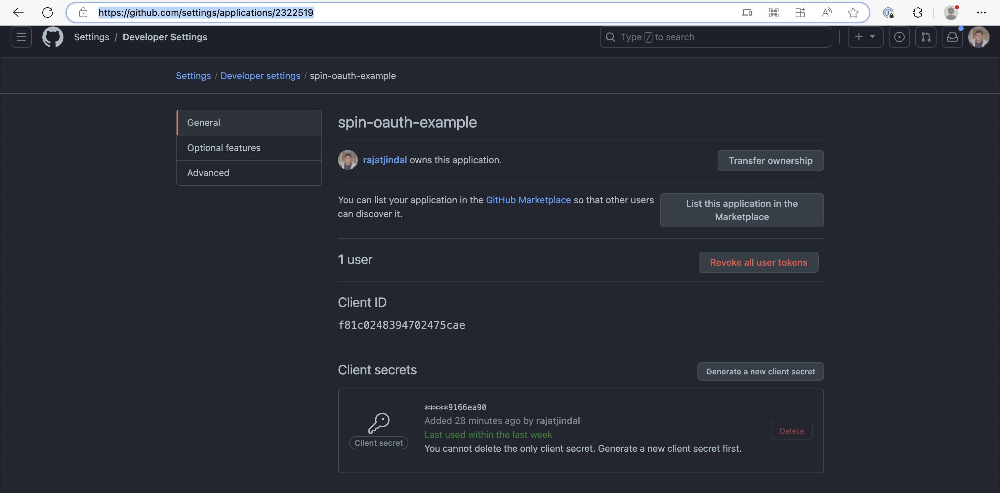

# example of using oauth login spin component

Create a new GitHub app by navigating to https://github.com/settings/applications/new

Note: your callback url should be `<your spin app url>/internal/login/callback`



Create a new client secret, make note of it



Deploy to Fermyon Cloud

```bash
spin deploy --variable client_id=<client_id> --variable client_secret=<client_secret>
```

and just open `<your spin app url>/internal/login/callback` in browser and click on `Login with GitHub` button.